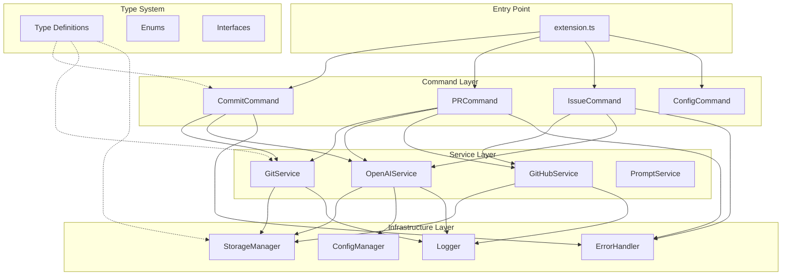

# Design Document

## Overview

このドキュメントは、otak-committer VS Code拡張機能の包括的なアーキテクチャリファクタリングの設計を定義します。現在の実装は機能的には動作していますが、以下の課題があります：

- **extension.tsの肥大化**: 約200行のコードに初期化、コマンド登録、UI管理が混在
- **型定義の分散**: 型定義が複数のファイルに分散し、一部が適切にエクスポートされていない
- **状態管理の複雑性**: SecretStorageとConfigurationの二重管理、マイグレーションロジックの複雑化
- **エラーハンドリングの不統一**: 各コマンドで異なるエラー処理パターン
- **テストの不足**: 現在のテストカバレッジが不十分

このリファクタリングは、以下の原則に基づいて設計されています：

1. **単一責任の原則**: 各モジュールは1つの明確な責任を持つ
2. **依存性の逆転**: 高レベルモジュールは低レベルモジュールに依存しない
3. **インターフェース分離**: クライアントは使用しないメソッドに依存しない
4. **開放閉鎖の原則**: 拡張に対して開いており、修正に対して閉じている

## Architecture

### High-Level Architecture



### Layer Responsibilities

#### Entry Point Layer
- **extension.ts**: 拡張機能のライフサイクル管理（activate/deactivate）
- コマンドの登録とディスポーザブルの管理
- 最小限の初期化ロジック（50行以下を目標）

#### Command Layer
- 各コマンドは独立したモジュールとして実装
- VS Code APIとの相互作用を担当
- ビジネスロジックはServiceLayerに委譲
- 統一されたエラーハンドリング

#### Service Layer
- ビジネスロジックの実装
- 外部API（OpenAI、GitHub）との通信
- Gitリポジトリ操作
- 状態を持たない（ステートレス）設計

#### Infrastructure Layer
- 横断的関心事の実装
- ストレージ管理（SecretStorage、Configuration）
- エラーハンドリングとロギング
- 設定管理

#### Type System
- すべての型定義を一元管理
- 循環依存の排除
- 適切なエクスポート戦略

## Components and Interfaces

### 1. Command Registry

コマンド登録を一元管理するレジストリパターンを導入します。

```typescript
// src/commands/registry.ts
export interface Command {
    id: string;
    handler: (...args: any[]) => Promise<void> | void;
    title: string;
    category?: string;
}

export class CommandRegistry {
    private commands: Map<string, Command> = new Map();
    
    register(command: Command): void {
        this.commands.set(command.id, command);
    }
    
    registerAll(context: vscode.ExtensionContext): void {
        for (const [id, command] of this.commands) {
            const disposable = vscode.commands.registerCommand(
                id,
                async (...args: any[]) => {
                    try {
                        await command.handler(...args);
                    } catch (error) {
                        ErrorHandler.handle(error, `Command ${id} failed`);
                    }
                }
            );
            context.subscriptions.push(disposable);
        }
    }
}
```

### 2. Storage Manager

SecretStorageとConfigurationを統一的に管理するマネージャーを実装します。

```typescript
// src/infrastructure/storage/StorageManager.ts
export interface StorageProvider {
    get(key: string): Promise<string | undefined>;
    set(key: string, value: string): Promise<void>;
    delete(key: string): Promise<void>;
    has(key: string): Promise<boolean>;
}

export class StorageManager {
    private secretStorage: SecretStorageProvider;
    private configStorage: ConfigStorageProvider;
    
    constructor(context: vscode.ExtensionContext) {
        this.secretStorage = new SecretStorageProvider(context);
        this.configStorage = new ConfigStorageProvider();
    }
    
    async getApiKey(service: 'openai' | 'github'): Promise<string | undefined> {
        // Try SecretStorage first
        const key = await this.secretStorage.get(`${service}.apiKey`);
        if (key) return key;
        
        // Fallback to encrypted global state
        return this.secretStorage.getFromBackup(`${service}.apiKey`);
    }
    
    async setApiKey(service: 'openai' | 'github', value: string): Promise<void> {
        await this.secretStorage.set(`${service}.apiKey`, value);
        // Also store encrypted backup
        await this.secretStorage.setBackup(`${service}.apiKey`, value);
    }
    
    async migrateFromLegacy(): Promise<void> {
        // Migration logic from Configuration to SecretStorage
        const legacyKey = this.configStorage.get('openaiApiKey');
        if (legacyKey) {
            await this.setApiKey('openai', legacyKey);
            await this.configStorage.delete('openaiApiKey');
        }
    }
}
```

### 3. Configuration Manager

設定の読み取りと更新を一元管理します。

```typescript
// src/infrastructure/config/ConfigManager.ts
export interface ExtensionConfig {
    language: SupportedLanguage;
    messageStyle: MessageStyle;
    useEmoji: boolean;
    emojiStyle: EmojiStyle;
    customMessage: string;
}

export class ConfigManager {
    private static readonly SECTION = 'otakCommitter';
    
    get<K extends keyof ExtensionConfig>(key: K): ExtensionConfig[K] {
        const config = vscode.workspace.getConfiguration(ConfigManager.SECTION);
        return config.get<ExtensionConfig[K]>(key) as ExtensionConfig[K];
    }
    
    async set<K extends keyof ExtensionConfig>(
        key: K,
        value: ExtensionConfig[K],
        target: vscode.ConfigurationTarget = vscode.ConfigurationTarget.Global
    ): Promise<void> {
        const config = vscode.workspace.getConfiguration(ConfigManager.SECTION);
        await config.update(key, value, target);
    }
    
    getAll(): ExtensionConfig {
        return {
            language: this.get('language'),
            messageStyle: this.get('messageStyle'),
            useEmoji: this.get('useEmoji'),
            emojiStyle: this.get('emojiStyle'),
            customMessage: this.get('customMessage')
        };
    }
    
    async setDefaults(): Promise<void> {
        if (!this.get('language')) {
            await this.set('language', 'english');
        }
        if (!this.get('messageStyle')) {
            await this.set('messageStyle', 'normal');
        }
    }
}
```

### 4. Error Handler

エラーハンドリングを標準化します。

```typescript
// src/infrastructure/error/ErrorHandler.ts
export enum ErrorSeverity {
    Info = 'info',
    Warning = 'warning',
    Error = 'error',
    Critical = 'critical'
}

export interface ErrorContext {
    operation: string;
    component: string;
    metadata?: Record<string, any>;
}

export class ErrorHandler {
    private static logger = Logger.getInstance();
    
    static handle(error: unknown, context: ErrorContext | string): void {
        const ctx = typeof context === 'string' 
            ? { operation: context, component: 'unknown' }
            : context;
        
        const severity = this.determineSeverity(error);
        const message = this.formatErrorMessage(error, ctx);
        
        // Log the error
        this.logger.log(severity, message, error);
        
        // Show user notification
        this.showUserNotification(severity, message);
        
        // Report to telemetry (if enabled)
        this.reportToTelemetry(error, ctx);
    }
    
    private static determineSeverity(error: unknown): ErrorSeverity {
        if (error instanceof CriticalError) return ErrorSeverity.Critical;
        if (error instanceof ValidationError) return ErrorSeverity.Warning;
        return ErrorSeverity.Error;
    }
    
    private static formatErrorMessage(error: unknown, ctx: ErrorContext): string {
        const errorMsg = error instanceof Error ? error.message : String(error);
        return `[${ctx.component}] ${ctx.operation}: ${errorMsg}`;
    }
    
    private static showUserNotification(severity: ErrorSeverity, message: string): void {
        switch (severity) {
            case ErrorSeverity.Critical:
            case ErrorSeverity.Error:
                vscode.window.showErrorMessage(message);
                break;
            case ErrorSeverity.Warning:
                vscode.window.showWarningMessage(message);
                break;
            case ErrorSeverity.Info:
                vscode.window.showInformationMessage(message);
                break;
        }
    }
    
    private static reportToTelemetry(error: unknown, ctx: ErrorContext): void {
        // Telemetry reporting logic (opt-in)
    }
}
```

### 5. Logger

統一されたロギングインターフェースを提供します。

```typescript
// src/infrastructure/logging/Logger.ts
export enum LogLevel {
    Debug = 0,
    Info = 1,
    Warning = 2,
    Error = 3
}

export class Logger {
    private static instance: Logger;
    private outputChannel: vscode.OutputChannel;
    private logLevel: LogLevel = LogLevel.Info;
    
    private constructor() {
        this.outputChannel = vscode.window.createOutputChannel('otak-committer');
    }
    
    static getInstance(): Logger {
        if (!Logger.instance) {
            Logger.instance = new Logger();
        }
        return Logger.instance;
    }
    
    setLogLevel(level: LogLevel): void {
        this.logLevel = level;
    }
    
    debug(message: string, ...args: any[]): void {
        this.log(LogLevel.Debug, message, ...args);
    }
    
    info(message: string, ...args: any[]): void {
        this.log(LogLevel.Info, message, ...args);
    }
    
    warning(message: string, ...args: any[]): void {
        this.log(LogLevel.Warning, message, ...args);
    }
    
    error(message: string, error?: unknown): void {
        this.log(LogLevel.Error, message, error);
    }
    
    log(level: LogLevel, message: string, ...args: any[]): void {
        if (level < this.logLevel) return;
        
        const timestamp = new Date().toISOString();
        const levelStr = LogLevel[level].toUpperCase();
        const formattedMessage = `[${timestamp}] [${levelStr}] ${message}`;
        
        this.outputChannel.appendLine(formattedMessage);
        
        if (args.length > 0) {
            this.outputChannel.appendLine(JSON.stringify(args, null, 2));
        }
        
        // Also log to console for development
        console.log(formattedMessage, ...args);
    }
    
    show(): void {
        this.outputChannel.show();
    }
    
    dispose(): void {
        this.outputChannel.dispose();
    }
}
```

### 6. Command Base Class

すべてのコマンドが継承する基底クラスを提供します。

```typescript
// src/commands/BaseCommand.ts
export abstract class BaseCommand {
    protected logger: Logger;
    protected config: ConfigManager;
    protected storage: StorageManager;
    
    constructor(
        protected context: vscode.ExtensionContext
    ) {
        this.logger = Logger.getInstance();
        this.config = new ConfigManager();
        this.storage = new StorageManager(context);
    }
    
    abstract execute(...args: any[]): Promise<void>;
    
    protected async withProgress<T>(
        title: string,
        task: () => Promise<T>
    ): Promise<T> {
        return vscode.window.withProgress(
            {
                location: vscode.ProgressLocation.Notification,
                title,
                cancellable: false
            },
            task
        );
    }
    
    protected handleError(error: unknown, operation: string): void {
        ErrorHandler.handle(error, {
            operation,
            component: this.constructor.name
        });
    }
}
```

## Data Models

### Type Organization

型定義を以下のように再編成します：

```
src/types/
├── index.ts              # メインエクスポート
├── enums/
│   ├── index.ts
│   ├── MessageStyle.ts
│   ├── EmojiStyle.ts
│   ├── SupportedLanguage.ts
│   └── ErrorCode.ts
├── interfaces/
│   ├── index.ts
│   ├── Config.ts
│   ├── Service.ts
│   ├── Storage.ts
│   ├── Git.ts
│   └── GitHub.ts
└── errors/
    ├── index.ts
    ├── BaseError.ts
    ├── ValidationError.ts
    └── ServiceError.ts
```

### Core Type Definitions

```typescript
// src/types/enums/MessageStyle.ts
export enum MessageStyle {
    Simple = 'simple',
    Normal = 'normal',
    Detailed = 'detailed'
}

export enum EmojiStyle {
    GitHub = 'github',
    Unicode = 'unicode'
}

// src/types/enums/SupportedLanguage.ts
export enum SupportedLanguage {
    English = 'english',
    Japanese = 'japanese',
    Chinese = 'chinese',
    // ... other languages
}

// src/types/interfaces/Config.ts
export interface ExtensionConfig {
    language: SupportedLanguage;
    messageStyle: MessageStyle;
    useEmoji: boolean;
    emojiStyle: EmojiStyle;
    customMessage: string;
}

export interface ServiceConfig {
    openaiApiKey?: string;
    githubToken?: string;
    config: ExtensionConfig;
}

// src/types/interfaces/Storage.ts
export interface StorageKey {
    service: 'openai' | 'github';
    key: string;
}

export interface StorageValue {
    value: string;
    encrypted: boolean;
    timestamp: number;
}

// src/types/errors/BaseError.ts
export abstract class BaseError extends Error {
    constructor(
        message: string,
        public readonly code: string,
        public readonly context?: Record<string, any>
    ) {
        super(message);
        this.name = this.constructor.name;
        Error.captureStackTrace(this, this.constructor);
    }
}

export class ValidationError extends BaseError {
    constructor(message: string, context?: Record<string, any>) {
        super(message, 'VALIDATION_ERROR', context);
    }
}

export class ServiceError extends BaseError {
    constructor(
        message: string,
        public readonly service: string,
        context?: Record<string, any>
    ) {
        super(message, 'SERVICE_ERROR', context);
    }
}

export class StorageError extends BaseError {
    constructor(message: string, context?: Record<string, any>) {
        super(message, 'STORAGE_ERROR', context);
    }
}
```


## Correctness Properties

*A property is a characteristic or behavior that should hold true across all valid executions of a system-essentially, a formal statement about what the system should do. Properties serve as the bridge between human-readable specifications and machine-verifiable correctness guarantees.*

### Property 1: No Circular Dependencies

*For any* two modules A and B in the codebase, if A imports from B, then B should not import from A (directly or transitively).

**Validates: Requirements 1.4, 6.3, 8.1**

**Rationale**: Circular dependencies make code harder to understand, test, and maintain. They can lead to initialization order issues and make it impossible to use modules independently. This property ensures a clean, acyclic dependency graph.

### Property 2: Command Independence

*For any* command C in the system, executing C should not require any other command to have been executed first, and C should not directly import or invoke any other command.

**Validates: Requirements 2.4, 5.3**

**Rationale**: Independent commands are easier to test, maintain, and reason about. This property ensures commands can be executed in any order and don't have hidden dependencies on each other.

### Property 3: Unified Storage Abstraction

*For any* storage operation (get, set, delete, has), the operation should go through the StorageManager interface rather than directly accessing VS Code's SecretStorage or Configuration APIs.

**Validates: Requirements 3.1**

**Rationale**: A unified storage abstraction provides a single point of control for all persistence operations, making it easier to add features like encryption, caching, or migration logic.

### Property 4: Automatic Legacy Migration

*For any* legacy data format that exists in Configuration storage, when the extension activates, the data should be automatically migrated to the new SecretStorage format and the legacy format should be cleared.

**Validates: Requirements 3.2**

**Rationale**: Automatic migration ensures users don't lose their settings when upgrading and don't need to manually reconfigure the extension.

### Property 5: Migration Fallback Resilience

*For any* migration operation that fails, the system should fall back to using the legacy data format and continue functioning without crashing.

**Validates: Requirements 3.3**

**Rationale**: Migration failures should not break the extension. Users should be able to continue using the extension even if migration fails, with appropriate warnings.

### Property 6: Storage Consistency

*For any* configuration key K, if a value V is stored in SecretStorage, then reading K should return V, and the value should not exist in plain-text Configuration storage.

**Validates: Requirements 3.4**

**Rationale**: Sensitive data should only exist in encrypted storage. This property ensures we don't have inconsistent state where the same data exists in multiple locations.

### Property 7: Centralized Error Handling

*For any* error E that occurs in any component, E should be routed through the ErrorHandler class rather than being handled locally with ad-hoc error handling code.

**Validates: Requirements 4.1**

**Rationale**: Centralized error handling ensures consistent error logging, user notifications, and telemetry reporting across the entire extension.

### Property 8: Operation Fallback Behavior

*For any* operation O that can fail, if O fails, the system should provide a fallback behavior (default value, cached value, or graceful degradation) rather than crashing or leaving the system in an inconsistent state.

**Validates: Requirements 4.2**

**Rationale**: Robust error handling with fallbacks ensures the extension remains usable even when external services fail or unexpected errors occur.

### Property 9: Consistent Command Error Handling

*For any* command C, if an error occurs during C's execution, the error should be handled using the same error handling pattern (try-catch with ErrorHandler.handle) as all other commands.

**Validates: Requirements 4.4**

**Rationale**: Consistent error handling makes the codebase more maintainable and ensures users get a consistent experience regardless of which command fails.

### Property 10: Standardized Command Context

*For any* command C, when C is executed, it should receive a standardized context object that includes the extension context, logger, config manager, and storage manager.

**Validates: Requirements 5.4**

**Rationale**: Standardized context ensures all commands have access to the same infrastructure services and reduces boilerplate code in command implementations.

### Property 11: File Size Constraints

*For any* source file F in the codebase, the size of F should not exceed 300 lines of code (excluding comments and blank lines).

**Validates: Requirements 8.2**

**Rationale**: Large files are harder to understand and maintain. This constraint encourages proper separation of concerns and modular design.

### Property 12: Standardized Folder Structure

*For any* module M, M should be located in the appropriate folder according to its responsibility: commands in src/commands/, services in src/services/, infrastructure in src/infrastructure/, types in src/types/.

**Validates: Requirements 8.3**

**Rationale**: A consistent folder structure makes the codebase easier to navigate and understand. Developers can quickly find related code.

### Property 13: Clear Module Boundaries

*For any* module M in a layer L, M should only import from modules in the same layer L or lower layers, never from higher layers.

**Validates: Requirements 8.4**

**Rationale**: Clear layering prevents high-level business logic from depending on low-level implementation details and makes the architecture easier to understand and modify.

### Property 14: Public API Documentation

*For any* exported function, class, or interface I, I should have a JSDoc comment that describes its purpose, parameters, return value, and any important behavior.

**Validates: Requirements 9.1**

**Rationale**: Documentation helps developers understand how to use the API correctly and reduces the need to read implementation code.

## Error Handling

### Error Hierarchy

すべてのエラーは`BaseError`クラスを継承し、統一されたエラーハンドリングを実現します。

```typescript
BaseError (abstract)
├── ValidationError
├── ServiceError
│   ├── OpenAIServiceError
│   ├── GitHubServiceError
│   └── GitServiceError
├── StorageError
│   ├── SecretStorageError
│   └── ConfigurationError
├── CommandError
└── CriticalError
```

### Error Handling Strategy

1. **Catch at Boundaries**: コマンドレイヤーでエラーをキャッチ
2. **Transform and Enrich**: エラーにコンテキスト情報を追加
3. **Centralized Handling**: ErrorHandlerで統一的に処理
4. **User Notification**: 適切なレベルでユーザーに通知
5. **Logging**: すべてのエラーをログに記録
6. **Graceful Degradation**: 可能な限りフォールバック動作を提供

### Fallback Mechanisms

| Operation | Primary | Fallback 1 | Fallback 2 |
|-----------|---------|------------|------------|
| API Key Retrieval | SecretStorage | Encrypted GlobalState | Prompt User |
| Configuration | Workspace Config | Global Config | Default Values |
| Git Operations | simple-git | VS Code Git API | Manual Input |
| OpenAI API | gpt-4.1 | gpt-3.5-turbo | Cached Response |

## Testing Strategy

### Dual Testing Approach

このプロジェクトでは、ユニットテストとプロパティベーステストの両方を使用します：

- **Unit Tests**: 特定の例、エッジケース、統合ポイントを検証
- **Property-Based Tests**: 普遍的なプロパティがすべての入力で成立することを検証

両者は補完的であり、包括的なカバレッジを提供します。

### Property-Based Testing

**Testing Library**: TypeScriptのプロパティベーステストには`fast-check`を使用します。

**Configuration**: 各プロパティベーステストは最低100回の反復を実行します。

**Tagging Convention**: 各プロパティベーステストには、設計ドキュメントのプロパティを参照するコメントを付けます：

```typescript
// **Feature: extension-architecture-refactoring, Property 1: No Circular Dependencies**
test('module dependency graph should be acyclic', () => {
    fc.assert(
        fc.property(fc.array(fc.string()), (modules) => {
            // Test implementation
        }),
        { numRuns: 100 }
    );
});
```

### Unit Testing

Unit testsは以下をカバーします：

1. **Specific Examples**: 
   - StorageManagerが正しくAPIキーを保存・取得できること
   - ConfigManagerがデフォルト値を正しく設定できること
   - ErrorHandlerが異なる重要度のエラーを正しく処理できること

2. **Edge Cases**:
   - 空の設定値の処理
   - 無効なAPIキー形式の処理
   - ネットワークタイムアウトの処理

3. **Integration Points**:
   - CommandRegistryがVS Code APIと正しく統合されること
   - StorageManagerがSecretStorageとConfigurationの両方と正しく動作すること

### Test Organization

```
src/
├── commands/
│   ├── __tests__/
│   │   ├── BaseCommand.test.ts
│   │   ├── CommitCommand.test.ts
│   │   └── registry.test.ts
│   └── ...
├── infrastructure/
│   ├── __tests__/
│   │   ├── StorageManager.test.ts
│   │   ├── ConfigManager.test.ts
│   │   ├── ErrorHandler.test.ts
│   │   └── Logger.test.ts
│   └── ...
└── __tests__/
    ├── properties/
    │   ├── dependencies.property.test.ts
    │   ├── commands.property.test.ts
    │   ├── storage.property.test.ts
    │   ├── errors.property.test.ts
    │   └── architecture.property.test.ts
    └── integration/
        ├── extension.integration.test.ts
        └── commands.integration.test.ts
```

### Property Test Examples

#### Property 1: No Circular Dependencies

```typescript
import fc from 'fast-check';
import { analyzeModuleDependencies } from '../utils/dependency-analyzer';

// **Feature: extension-architecture-refactoring, Property 1: No Circular Dependencies**
describe('Module Dependencies', () => {
    test('should have no circular dependencies', () => {
        const modules = analyzeModuleDependencies('./src');
        const cycles = findCycles(modules);
        expect(cycles).toHaveLength(0);
    });
});
```

#### Property 3: Unified Storage Abstraction

```typescript
// **Feature: extension-architecture-refactoring, Property 3: Unified Storage Abstraction**
describe('Storage Operations', () => {
    test('all storage operations should go through StorageManager', () => {
        fc.assert(
            fc.property(
                fc.record({
                    key: fc.string(),
                    value: fc.string()
                }),
                async ({ key, value }) => {
                    const storage = new StorageManager(mockContext);
                    await storage.set(key, value);
                    const retrieved = await storage.get(key);
                    return retrieved === value;
                }
            ),
            { numRuns: 100 }
        );
    });
});
```

#### Property 6: Storage Consistency

```typescript
// **Feature: extension-architecture-refactoring, Property 6: Storage Consistency**
describe('Storage Consistency', () => {
    test('sensitive data should only exist in SecretStorage', () => {
        fc.assert(
            fc.property(
                fc.string().filter(s => s.startsWith('sk-')),
                async (apiKey) => {
                    const storage = new StorageManager(mockContext);
                    await storage.setApiKey('openai', apiKey);
                    
                    // Should be in SecretStorage
                    const fromSecret = await mockContext.secrets.get('openai.apiKey');
                    expect(fromSecret).toBe(apiKey);
                    
                    // Should NOT be in Configuration
                    const config = vscode.workspace.getConfiguration('otakCommitter');
                    const fromConfig = config.get('openaiApiKey');
                    expect(fromConfig).toBeUndefined();
                    
                    return true;
                }
            ),
            { numRuns: 100 }
        );
    });
});
```

### Test Execution

- **Development**: `npm test` - すべてのテストを実行
- **Watch Mode**: `npm test -- --watch` - ファイル変更時に自動実行
- **Coverage**: `npm test -- --coverage` - カバレッジレポートを生成
- **CI**: GitHub Actionsで自動実行、カバレッジ80%以上を要求

## Implementation Phases

このリファクタリングは段階的に実装します：

### Phase 1: Infrastructure Foundation (Week 1)
- Type system reorganization
- Logger implementation
- ErrorHandler implementation
- ConfigManager implementation

### Phase 2: Storage Layer (Week 2)
- StorageManager implementation
- Migration logic
- Fallback mechanisms
- Storage tests

### Phase 3: Command Layer (Week 3)
- BaseCommand implementation
- CommandRegistry implementation
- Refactor existing commands
- Command tests

### Phase 4: Integration & Testing (Week 4)
- Property-based tests
- Integration tests
- Documentation
- Final cleanup

## Migration Strategy

既存のコードを段階的に移行します：

1. **New Infrastructure First**: 新しいインフラストラクチャコンポーネントを実装
2. **Parallel Implementation**: 既存のコードを残したまま新しいコードを追加
3. **Gradual Migration**: 1つずつコマンドを新しいアーキテクチャに移行
4. **Deprecation**: 古いコードを非推奨としてマーク
5. **Removal**: すべての移行が完了したら古いコードを削除

## Success Criteria

リファクタリングの成功は以下で測定します：

- ✅ すべてのプロパティベーステストが合格
- ✅ ユニットテストカバレッジ80%以上
- ✅ extension.tsが50行以下
- ✅ 循環依存が0
- ✅ すべてのファイルが300行以下
- ✅ すべての公開APIにJSDocコメント
- ✅ 既存の機能がすべて動作
- ✅ パフォーマンスの劣化なし
