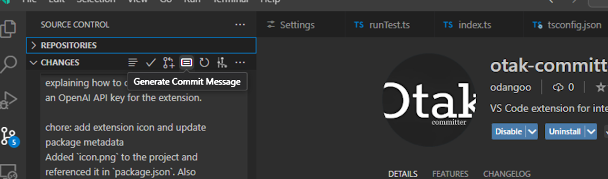

  <h1 align="center">otak-committer</h1>
  
VS Code extension for intelligent SCM operations - Multilingual commit message generation with AI support (9 languages supported) and future PR management features.

---

## Features

otak-committer is a powerful VS Code extension that leverages AI to automatically generate Git commit messages.

### Key Features

- **Multilingual Support**: Generate commit messages in 9 languages:
  - 🇺🇸 English
  - 🇫🇷 French (Français)
  - 🇩🇪 German (Deutsch)
  - 🇮🇹 Italian (Italiano)
  - 🇯🇵 Japanese (日本語)
  - 🇨🇳 Chinese (中文)
  - 🇰🇷 Korean (한국어)
  - 🇻🇳 Vietnamese (Tiếng Việt)
  - 🇷🇺 Russian (Русский)

- **Flexible Message Styles**: Choose from three levels of detail for your commit messages:
  - Simple: Concise summary (100 tokens)
  - Normal: Standard length with context (200 tokens)
  - Detailed: Comprehensive explanation (500 tokens)

- **Git SCM Integration**: Seamlessly integrated into VS Code's Git interface with a dedicated button in the SCM view.

## Requirements

- Visual Studio Code ^1.97.0
- Git installed and configured
- OpenAI API key

### Getting OpenAI API Key

To use this extension, you need an OpenAI API key. Here's how to get one:

1. Go to [OpenAI API Keys page](https://platform.openai.com/api-keys)
2. Sign in or create an OpenAI account
3. Create a new API key
4. Copy the API key
5. Open VS Code Settings (File > Preferences > Settings)
6. Search for "otakCommitter.openaiApiKey"
7. Paste your API key into the text field

Note: The extension uses GPT-4o model to generate commit messages. Make sure your OpenAI account has access to GPT-4o API.

## Installation

1. Install the extension from the VS Code Marketplace
2. Configure your OpenAI API key in the extension settings
3. Select your preferred language and message style
   (Default language is English)

## Extension Settings

This extension contributes the following settings:

- `otakCommitter.openaiApiKey`: OpenAI API Key for generating commit messages
- `otakCommitter.language`: Language for commit messages (default: "english")
- `otakCommitter.messageStyle`: Style and length of generated commit messages (default: "normal")

## Usage

1. Stage your changes in Git

After staging your changes, you'll see the "Generate Commit Message" button in the Source Control view:

2. Click the "Generate Commit Message" button in the SCM view (or use the command palette)
3. Review and optionally edit the generated message
4. Commit your changes

## Commands

- `otak-committer.generateMessage`: Generate a commit message for staged changes
- `otak-committer.openSettings`: Open the extension settings

## Contributing

Contributions are welcome! Please feel free to submit a Pull Request. For major changes, please open an issue first to discuss what you would like to change.

## License

This project is licensed under the MIT License - see the LICENSE file for details.

---

For more information, visit the [GitHub repository](https://github.com/tsuyoshi-otake-system-exe-jp/otak-committer).
