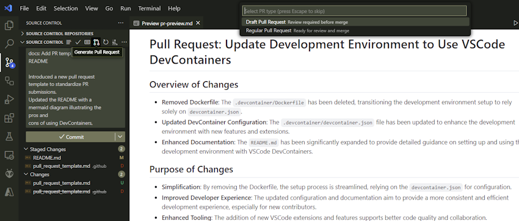
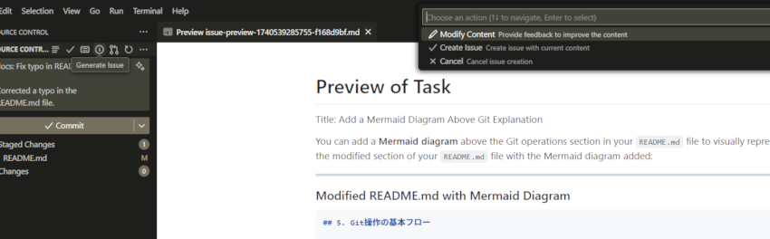
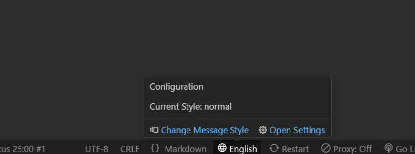
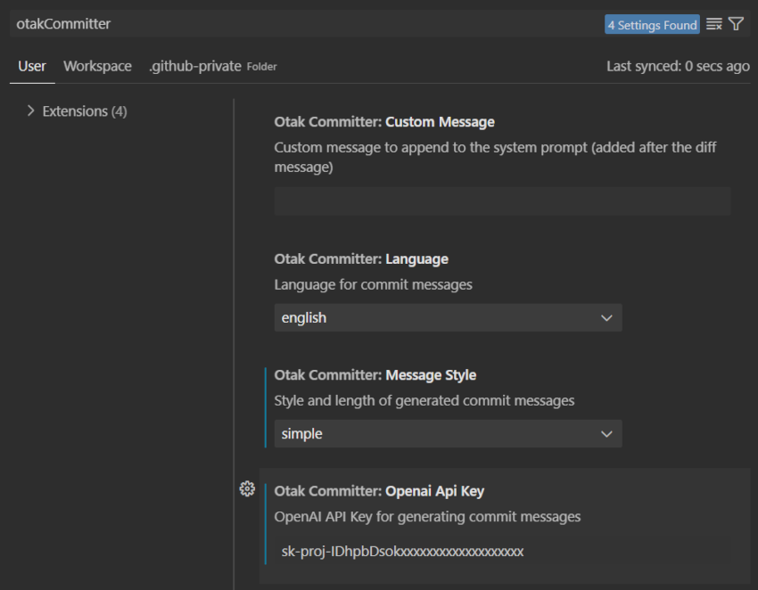

<p align="center">
  <h1 align="center">otak-committer</h1>
  <p align="center">
    AI-powered Git commit messages and pull requests for VS Code. Generate intelligent commit messages in 25 languages with full UI internationalization support.
  </p>
</p>

---

## Quick Start

### Generate Commit Messages


1. Stage your changes
2. Click the "Generate Commit Message" button in the Source Control panel
3. Review and edit the generated message
4. Commit your changes

The extension automatically:
- Detects and uses your project's commit templates (`.gitmessage`, `.github/commit_template`, etc.)
- Follows your repository's commit conventions
- Adapts to your project's style

### Create Pull Requests



1. Click "Generate Pull Request" in the Source Control panel
2. Select an issue to link (optional)
3. Choose your target and base branches
4. Review the AI-generated description
5. Submit as draft or ready for review

The extension automatically:
- Links related issues
- Uses your PR templates
- Applies labels and milestones from linked issues
- Generates context-aware descriptions

**Note:** Requires a GitHub token with `repo` scope.

### Create Issues



1. Click "Generate Issue" in the Source Control panel
2. Choose the issue type (bug, feature, task, etc.)
3. Select relevant files for context (optional)
4. Describe your issue
5. Review the AI-enhanced description
6. Create or modify before submitting

The AI automatically:
- Generates clear, actionable titles
- Structures descriptions based on type
- Includes relevant technical context
- Adds appropriate labels

## Features

### Full UI Internationalization
The extension now supports complete UI internationalization with automatic language detection:

- **Automatic Language Detection**: Detects your VS Code display language and uses it for the UI
- **Manual Language Selection**: Override automatic detection with your preferred language
- **Persistent Preferences**: Your language choice is saved across sessions
- **Supported UI Languages**: English, Japanese, Korean, Vietnamese, Simplified Chinese, Traditional Chinese

All UI elements including menus, notifications, error messages, and dialogs are translated into your selected language.

### Multilingual Commit Messages
Generate commit messages in 25 languages:

- English
- Français
- Deutsch
- Italiano
- Español
- Português
- Čeština
- Magyar
- Български
- Türkçe
- Polski
- Русский
- 日本語
- 中文
- 繁體中文
- 한국어
- Tiếng Việt
- ไทย
- हिन्दी
- বাংলা
- Basa Jawa
- தமிழ்
- မြန်မာဘာသာ
- العربية
- עברית

### Flexible Message Styles
- **Simple**: Brief, one-line summaries
- **Normal**: Standard commits with context
- **Detailed**: Comprehensive explanations with full context

### Seamless Integration
- Native VS Code Source Control integration
- One-click generation from the SCM panel
- Status bar controls for quick access
- Internationalized UI that adapts to your language preferences
- Automatic language detection based on VS Code settings

### Quick Controls

- Switch languages instantly from the status bar
- View current settings at a glance
- Access all features with one click

### Smart Pull Requests
- AI-generated descriptions based on your changes
- Automatic issue linking and label application
- Support for PR templates
- Draft and ready-for-review options

### Custom Instructions
Tailor AI behavior to your team's needs:

```
// Examples:
"Include JIRA ticket [PROJ-XXX] in commit messages"
"Add breaking changes section when modifying APIs"
"Reference design docs for UI changes"
```

Configure via `otakCommitter.customMessage` in settings.

## Security & Privacy

We take your security and privacy seriously. This extension is built with the highest standards of data protection:

### API Key Protection
- **Secure Storage**: All API keys are stored using VS Code's SecretStorage API, never in plain text
- **Encrypted Backups**: Redundant storage uses AES-256-GCM encryption with machine-specific keys
- **Automatic Migration**: Legacy API keys in settings are automatically moved to secure storage and deleted
- **No Configuration Files**: API keys never appear in `settings.json` or any configuration files that could be accidentally committed
- **Diagnostic Tools**: Built-in storage diagnostics to verify secure storage is working correctly

### Data Handling
- **Local Processing**: Git diff analysis happens locally on your machine
- **Minimal Data Transfer**: Only necessary diff information is sent to OpenAI for commit message generation
- **No Data Retention**: We don't store or log your code, commits, or any repository information
- **Direct API Communication**: All requests go directly to OpenAI's API - no intermediate servers
- **Token Limits**: Large diffs are automatically truncated to prevent accidental exposure of extensive codebases

### Privacy Guarantees
- **No Telemetry**: This extension collects no usage data, analytics, or telemetry
- **No Third-Party Services**: Apart from OpenAI for generation and GitHub for PR/issue creation, no other external services are used
- **Open Source**: Full source code is available for security audits on [GitHub](https://github.com/tsuyoshi-otake/otak-committer)
- **Isolated Scope**: The extension only accesses staged Git changes and selected files when explicitly requested

### Secure Development
- **Single Maintainer**: Maintained by a single, accountable developer to prevent unauthorized code injection
- **Direct Control**: All code changes are personally reviewed and tested before release
- **No External Contributors**: Eliminates risks associated with malicious pull requests or compromised contributor accounts
- **Transparent Updates**: Every update is documented in the changelog with clear descriptions of changes
- **Consistent Security Standards**: Uniform security practices across all code, ensuring no weak points from varying coding standards

### GitHub Integration
- **Minimal Permissions**: Only requests the `repo` scope for PR and issue operations
- **Token Security**: GitHub tokens are stored in the same secure storage as API keys
- **Official API**: Uses GitHub's official REST API with standard authentication

### Best Practices
- We recommend using dedicated API keys for this extension
- Regularly rotate your API keys for additional security
- Review generated content before committing or submitting PRs
- Use the diagnostic tools to verify secure storage is working correctly

## Requirements

- Visual Studio Code 1.90.0 or higher
- Git
- OpenAI API key (for AI features)

### Setting Up Your OpenAI API Key

1. Get your API key from [OpenAI](https://platform.openai.com/api-keys)
2. In VS Code, run the command: `otak-committer: Set OpenAI API Key`
3. Enter your API key when prompted

The extension uses GPT-4o for optimal results. Your API key is stored securely using VS Code's secret storage.

### Setting Up GitHub Access

For PR and issue features:

1. Create a [GitHub Personal Access Token](https://github.com/settings/tokens)
2. Select the `repo` scope
3. Copy the token
4. Add it to VS Code settings: `otakCommitter.github.token`

The `repo` scope enables:
- Creating pull requests
- Linking issues
- Applying labels and milestones

## GitHub Authentication

This extension uses VS Code's built-in GitHub authentication. Sign in and out through the Accounts icon in the Activity Bar.

## Installation

1. Install from the [VS Code Marketplace](https://marketplace.visualstudio.com/items?itemName=odangoo.otak-committer)
2. Set your OpenAI API key when prompted
3. Start using it immediately - the extension appears in your status bar

Default: English, Normal style. Change anytime from the status bar.

## Configuration



### Available Settings

- **`otakCommitter.language`**: Commit message language (default: `english`)
  - Supports 25 languages from English to Arabic, Japanese, Chinese, and more

- **`otakCommitter.messageStyle`**: Message detail level (default: `normal`)
  - `simple`: One-line summaries
  - `normal`: Standard commits with context
  - `detailed`: Comprehensive explanations

- **`otakCommitter.i18n.uiLanguage`**: UI language preference (default: `auto`)
  - `auto`: Automatically detect from VS Code display language
  - `en`: English
  - `ja`: Japanese (日本語)
  - `ko`: Korean (한국어)
  - `vi`: Vietnamese (Tiếng Việt)
  - `zh-cn`: Simplified Chinese (简体中文)
  - `zh-tw`: Traditional Chinese (繁體中文)

- **`otakCommitter.github.token`**: GitHub token for PR/issue features

- **`otakCommitter.customMessage`**: Custom AI instructions (optional)

- **`otakCommitter.useEmoji`**: Enable emoji prefixes in commit messages (default: `false`)

- **`otakCommitter.emojiStyle`**: Emoji format - `github` or `unicode`

## Commands

Access via Command Palette (`Cmd/Ctrl+Shift+P`):

- `Generate Commit Message`: Create AI-powered commit messages
- `Generate Pull Request`: Create PRs with smart descriptions
- `Generate Issue`: Create structured GitHub issues
- `Set OpenAI API Key`: Configure your API key
- `Change Language`: Switch commit message language
- `Change Message Style`: Adjust detail level
- `Diagnose API Key Storage`: Verify secure storage is working correctly
- `Open Settings`: Quick access to configuration

## Related Extensions

Check out our other VS Code extensions:

### [otak-monitor](https://marketplace.visualstudio.com/items?itemName=odangoo.otak-monitor)
Real-time system monitoring in VS Code. Track CPU, memory, and disk usage through the status bar with comprehensive tooltips and 1-minute averages.

### [otak-proxy](https://marketplace.visualstudio.com/items?itemName=odangoo.otak-proxy)
One-click proxy configuration for VS Code and Git. Perfect for environments where network settings change frequently.

### [otak-restart](https://marketplace.visualstudio.com/items?itemName=odangoo.otak-restart)
Quick restart operations for Extension Host and VS Code window via status bar tooltip. Streamlines your development workflow.

### [otak-clock](https://marketplace.visualstudio.com/items?itemName=odangoo.otak-clock)
Display date and time for two time zones from around the world in VS Code. Essential for working across different time zones.

### [otak-pomodoro](https://marketplace.visualstudio.com/items?itemName=odangoo.otak-pomodoro)
Enhance your productivity with this Pomodoro Timer extension. Helps balance focused work sessions with refreshing breaks using the Pomodoro Technique.

### [otak-zen](https://marketplace.visualstudio.com/items?itemName=odangoo.otak-zen)
Experience a distraction-free workflow with otak-zen. This extension transforms your VS Code interface into a minimalist environment by hiding non-essential UI elements, allowing you to focus solely on coding.

## License

MIT License - see the [LICENSE](LICENSE) file for details.

---

For more information, visit the [GitHub repository](https://github.com/tsuyoshi-otake/otak-committer).