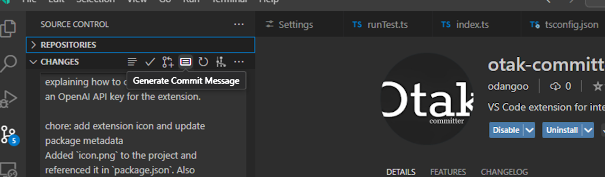
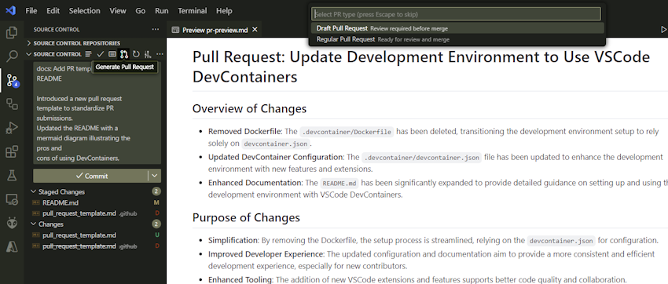
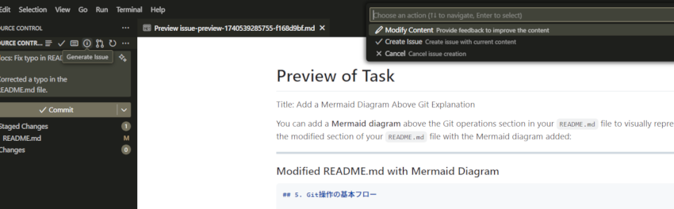
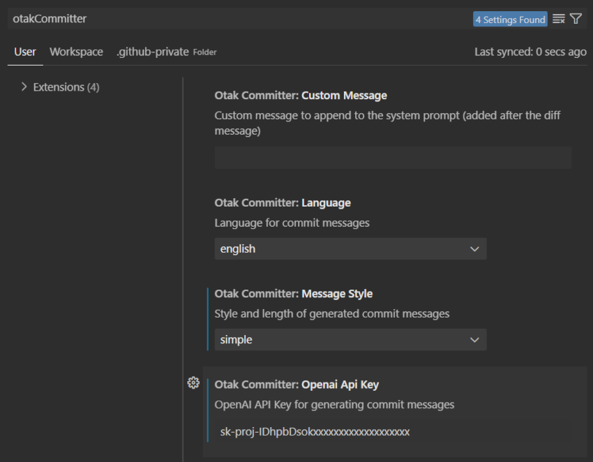

<div align="center">

# otak-committer

**AI-assisted commit messages, pull requests, and issues — without leaving VS Code.**  
otak-committer reads your staged diff, follows your templates and conventions, and writes commit messages, PR descriptions, and issues in 25 languages.

[](https://marketplace.visualstudio.com/items?itemName=odangoo.otak-committer)
[](https://code.visualstudio.com/)
[](LICENSE)
[](https://github.com/tsuyoshi-otake/otak-committer)


[**Install**](https://marketplace.visualstudio.com/items?itemName=odangoo.otak-committer) ·
[**GitHub**](https://github.com/tsuyoshi-otake/otak-committer) ·
[**Report an issue**](https://github.com/tsuyoshi-otake/otak-committer/issues)

</div>

---

Writing good commit messages, pull request descriptions, and issues is repetitive work that breaks your flow. otak-committer turns your staged changes into clear, conventional, and consistently formatted text in one click. It understands multiple languages, follows your repository's templates, supports Git worktrees, and fits team workflows — while keeping your code and API key handling local and private.



## Quick Start

1. **Install** from the [VS Code Marketplace](https://marketplace.visualstudio.com/items?itemName=odangoo.otak-committer).
2. Get an OpenAI API key from [OpenAI](https://platform.openai.com/api-keys).
3. Run `otak-committer: Set OpenAI API Key`.
4. Stage your changes, then click **Generate Commit Message** in Source Control.

By default the extension uses English and the Normal style. You can change both anytime from the status bar. PR and issue features additionally require GitHub sign-in via the Accounts icon in the Activity Bar.

### Commit Messages

1. Stage your changes.
2. Click **Generate Commit Message** in Source Control.
3. Review and edit the result.
4. Commit.

It uses your repository's commit templates (`.gitmessage`, `.github/commit_template`, etc.) and adapts to your conventions. It works with standard Git repositories and linked Git worktrees.

If nothing is staged, the extension offers to stage your tracked changes (**Stage All**, or **Always Stage** to skip this prompt from then on). Untracked files are never staged silently: whenever there are any, it lists them and asks whether to include them or stage tracked files only. If no message ends up in the commit box — you cancel, decline a secret warning, or generation fails — the files the extension staged are unstaged again. Running the command again while a message is being generated cancels the earlier request; the new run starts once the earlier one has finished cleaning up its staging.

### Pull Requests



1. Click **Generate Pull Request** in Source Control.
2. Select an issue to link, if needed.
3. Choose the base and compare branches.
4. Review the generated description.
5. Submit as draft or ready for review.

Automatically uses PR templates and links issues when available. Requires GitHub sign-in via VS Code.

### Issues



1. Click **Generate Issue** in Source Control.
2. Choose the issue type (bug, feature, task, etc.).
3. Select relevant files for context (optional).
4. Describe your issue.
5. Review the AI-enhanced description.
6. Edit if needed, then create the issue.

Generates clear titles and structured descriptions.

## Capabilities

- **UI internationalization**: automatically detects your VS Code display language, or lets you choose one manually.
- **Multilingual commit messages**: generates messages in 25 languages, independent of the UI language.
- **Message styles**: `simple`, `normal`, or `detailed`.
- **Git worktree support**: resolves the current repository from the active workspace, including linked worktrees and multi-root setups, instead of assuming the first Git repository in the window. The commit button in a repository's Source Control title always targets that repository.
- **Repository visibility indicator**: the status bar shows whether the current repository is public (`$(globe)`) or private (`$(lock)`). Public repositories trigger a warning on open and a confirmation prompt before generating commit messages, helping prevent accidental exposure. Choose **Don't Show Again** to turn both off for that repository.
- **Deep VS Code integration**: Source Control panel actions, status bar controls, and full UI localization.
- **Smart PRs and issues**: context-aware descriptions, template support, and issue linking.
- **Custom instructions**: team-specific guidance via `otakCommitter.customMessage`.

## How It Works

### Commit Message Flow

- Resolves the current Git repository or worktree before reading diffs, templates, and branch state.
- Analyzes staged diffs locally.
- Handles large diffs with a three-tier strategy:
  - **Tier 1**: diffs within the token limit are sent as-is.
  - **Tier 2**: oversized diffs are split by file. Lock files (`package-lock.json`, `yarn.lock`, etc.) are excluded, source code is prioritized, and a change summary for all files is always included.
  - **Tier 3**: if Tier 2 still exceeds the budget, the remaining files are split into chunks, summarized through parallel API calls (always with `low` reasoning effort), and combined for commit message generation. A single file larger than one chunk is cut at line boundaries into labelled parts.
- Applies your commit template and style.
- Generates the result in your selected language and detail level.

### Pull Request Flow

- Generates a description from your changes.
- Honors your PR template.
- Links selected issues when available.
- Branch and issue pickers list up to 1,000 entries (10 pages of 100).
- If GitHub's compare API reaches its 300-file limit, you are warned that the description may not cover the remaining files.
- Generation can be cancelled from the progress notification; clicking the button again while it runs has no effect.

### Issue Flow

- Structures the issue based on the selected type.
- Adds concise, actionable titles and descriptions.
- Includes relevant context from selected files.
- Generation can be cancelled from the progress notification; clicking the button again while it runs has no effect.

### GitHub Authentication

Uses VS Code's built-in GitHub authentication. Sign in or out through the Accounts icon in the Activity Bar. When multiple repositories are open, PR and issue operations target the repository that matches the active workspace or worktree.

## Settings



| Setting | Default | Description |
| --- | --- | --- |
| `otakCommitter.language` | `english` | Commit message language |
| `otakCommitter.messageStyle` | `normal` | Message detail level (`simple`, `normal`, `detailed`) |
| `otakCommitter.customMessage` | `""` | Custom AI instructions (optional) |
| `otakCommitter.useEmoji` | `false` | Enable emoji prefixes |
| `otakCommitter.emojiStyle` | `github` | Emoji format (`github` or `unicode`) |
| `otakCommitter.openaiBaseUrl` | `""` | OpenAI pass-through gateway base URL (optional) |
| `otakCommitter.reasoningEffort` | `high` | AI reasoning depth (`none`, `low`, `medium`, `high`); Tier 3 chunk summaries always use `low` |
| `otakCommitter.maxInputTokens` | `200000` | Maximum input tokens for diff analysis (1,000–922,000) |
| `otakCommitter.useBulletList` | `true` | Format the commit message body as a bullet list |
| `otakCommitter.useConventionalCommits` | `true` | Use Conventional Commits format |
| `otakCommitter.appendCommitTrailer` | `true` | Append the `Commit-Message-By: otak-committer` trailer |

The extension UI language follows your VS Code display language (`Configure Display Language` command). Supported UI locales: `en`, `ja`, `ko`, `vi`, `fr`, `de`, `es`, `pt`, `zh-cn`, `zh-tw`, `it`, `cs`, `hu`, `bg`, `tr`, `pl`, `ru`, `th`, `hi`, `bn`, `jv`, `ta`, `my`, `ar`, `he`. Other locales fall back to English.

### OpenAI Models and Gateway

All OpenAI operations — commit message generation, Tier 3 large-diff summaries, pull request generation, and generic chat/issue operations — use `gpt-6-luna` by default.

By default, requests use `https://api.openai.com/v1`. To route validation and generation through an OpenAI pass-through gateway, set `otakCommitter.openaiBaseUrl` in VS Code settings. If that setting is empty, the extension checks `OPENAI_BASE_URL` and then falls back to the official endpoint:

```json
{
  "otakCommitter.openaiBaseUrl": "https://gateway.example.com/openai/v1"
}
```

Custom endpoint support intentionally targets endpoints that preserve OpenAI model IDs and the current Chat Completions request/response shape. The endpoint must accept `gpt-6-luna` unchanged and pass `reasoning_effort` values (including `none`) through; arbitrary local model servers or model-name translation are outside this compatibility contract.

Remote endpoints must use HTTPS. Plain HTTP is accepted only for exact loopback hosts (`localhost`, `127.0.0.1`, or `::1`) so a local development endpoint can be tested safely. URLs containing credentials, a query, or a fragment are rejected. A custom endpoint accepts any non-empty token; the official endpoint requires an OpenAI `sk-...` key.

The extension validates the configured connection through the same endpoint before generation. Custom endpoints may omit `GET /models`: a `404` or `405` on that route is treated as “validation unsupported,” and the first successful completion validates that endpoint-and-token pair for the current extension session.

### Custom Instruction Examples

```text
"Include JIRA ticket [PROJ-XXX] in commit messages"
"Add breaking changes section when modifying APIs"
"Reference design docs for UI changes"
```

## Commands

Access via the Command Palette (<kbd>Ctrl</kbd>/<kbd>Cmd</kbd>+<kbd>Shift</kbd>+<kbd>P</kbd>):

- `Generate Commit Message`
- `Generate Pull Request`
- `Generate Issue`
- `Set OpenAI API Key`
- `Change Language`
- `Change Message Style`
- `Diagnose API Key Storage`
- `Open Settings`

## Language Support

Commit messages can be generated in 25 languages, independent of the UI language:

**English** · Français · Deutsch · Italiano · Español · Português · Čeština · Magyar · Български · Türkçe · Polski · Русский · 日本語 · 中文 · 繁體中文 · 한국어 · Tiếng Việt · ไทย · हिन्दी · বাংলা · Basa Jawa · தமிழ் · မြန်မာဘာသာ · العربية · עברית

## Security & Privacy

### API Key Protection

- **Secure Storage only**: API keys are stored using VS Code SecretStorage.
- **No Settings Sync for API keys**: API keys are not stored in synced extension state.
- **No GlobalState backups**: API keys are not backed up to extension global state.
- **Automatic migration**: legacy API keys in settings are migrated to secure storage and deleted after the secure write succeeds. If secure storage is unavailable, legacy keys are preserved for retry but not used.
- **No `settings.json` secrets**: keys never appear in `settings.json`.
- **Diagnostic tools**: built-in diagnostics verify storage health.

### Data Handling

- Git diff analysis happens locally.
- **Secret detection**: before generation, diffs and selected file content are scanned for potential secrets (API keys, tokens, passwords, private keys, connection strings, environment variable references, etc.). The extension asks for confirmation before sending inputs that may contain secrets to the external AI service; map-reduce chunks are also checked and logged.
- **Log redaction**: the logger automatically redacts the values of credential-like fields in any naming style (`accessToken`, `client_secret`, `X-Api-Key`, `OPENAI_API_KEY`, …), known secret formats even inside longer text, URL-embedded credentials, and secrets in error stack traces. An error's string form never includes its context data.
- Only necessary diff context is sent to the configured OpenAI endpoint for generation.
- Large diffs are intelligently prioritized: lock files and generated files are excluded or summarized to minimize data sent to the API.

### Privacy Guarantees

- No telemetry or usage analytics.
- Requests go directly to OpenAI by default. If you configure a custom endpoint, request data and credentials are sent to that endpoint instead.
- Source code is available for security review on GitHub.

### GitHub Integration

- Uses GitHub's official REST API.
- Authenticates with the GitHub session from VS Code's built-in authentication; the extension does not use a personal access token. A legacy `otakCommitter.githubToken` setting is moved out of `settings.json` into secure storage.
- Only requests the `repo` scope for PR and issue operations.

### Best Practices

- Use dedicated API keys for this extension.
- Rotate API keys regularly.
- Review generated content before committing or submitting PRs.

## Requirements

- Visual Studio Code **1.90.0** or newer
- Git
- An OpenAI API key (for AI features)
- GitHub sign-in via VS Code (for PR and issue features)

## Installation

Install from the [VS Code Marketplace](https://marketplace.visualstudio.com/items?itemName=odangoo.otak-committer), or run:

```text
ext install odangoo.otak-committer
```

Then:

1. Get an OpenAI API key from [OpenAI](https://platform.openai.com/api-keys).
2. Run `otak-committer: Set OpenAI API Key`.
3. (Optional) Sign in to GitHub via the Accounts icon in the Activity Bar for PR and issue features.

Commit, PR, and generic chat/issue generation use GPT-6 Luna.

### Commit Model Quality Evaluation

Maintainers can compare the commit-message model against the previous model with:

```sh
npm run eval:commit-model
```

The evaluation uses 10 fixed representative diffs and makes 20 paid API calls: each diff is generated once with the previous commit model `gpt-5.6-luna` and once with `gpt-6-luna`, with concurrency capped at two. It writes an anonymized, blinded A/B review sheet and a run manifest under `~/tmp/otak-committer-eval/`. Set `OPENAI_API_KEY` (and optionally `OPENAI_BASE_URL`) before running it. Do not commit the generated review artifacts or credentials.

## Troubleshooting

- **No output or empty results**: ensure you have staged changes and an OpenAI API key configured.
- **PR/issue creation fails**: make sure you are signed in to GitHub via the Accounts icon in the Activity Bar.
- **Wrong repository selected in a multi-root window**: for commit messages, use the button in the target repository's Source Control title. For PRs and issues, focus a file in the target workspace or worktree and run the command again so the extension resolves the correct Git repository.
- **API key validation reports a rate limit**: the message shows the wait time from the server's `Retry-After` header (for example `retry after 30s`); try again after that.
- **Wrong UI language**: run `Configure Display Language` in VS Code and reload the window. Unsupported locales fall back to English.

## Related Extensions

More VS Code extensions by [odangoo](https://marketplace.visualstudio.com/publishers/odangoo):

| Extension | Description |
| --- | --- |
| [**otak-proxy**](https://marketplace.visualstudio.com/items?itemName=odangoo.otak-proxy) | One-click proxy switching for VS Code, Git, npm, and integrated terminals |
| [**otak-monitor**](https://marketplace.visualstudio.com/items?itemName=odangoo.otak-monitor) | Real-time CPU, memory, and disk usage in the status bar |
| [**otak-paste**](https://marketplace.visualstudio.com/items?itemName=odangoo.otak-paste) | Paste optimized screenshots into Markdown and keep your repository lighter |
| [**otak-clipboard**](https://marketplace.visualstudio.com/items?itemName=odangoo.otak-clipboard) | Copy a folder or the current tab to your clipboard in two clicks |
| [**otak-clock**](https://marketplace.visualstudio.com/items?itemName=odangoo.otak-clock) | Dual time-zone clock for the status bar |
| [**otak-pomodoro**](https://marketplace.visualstudio.com/items?itemName=odangoo.otak-pomodoro) | A Pomodoro focus timer built into VS Code |
| [**otak-restart**](https://marketplace.visualstudio.com/items?itemName=odangoo.otak-restart) | Quick Extension Host and window restart from the status bar |
| [**otak-zen**](https://marketplace.visualstudio.com/items?itemName=odangoo.otak-zen) | A calm, distraction-free Zen mode for VS Code |
| [**otak-lsp**](https://marketplace.visualstudio.com/items?itemName=odangoo.otak-lsp) | Japanese morphological analysis with grammar checks, semantic highlights, and hovers |
| [**otak-usage**](https://marketplace.visualstudio.com/items?itemName=odangoo.otak-usage) | At-a-glance usage statistics for VS Code |

## License

Released under the [MIT License](LICENSE).

<div align="center">
<br>
<sub>Built by <a href="https://github.com/tsuyoshi-otake">tsuyoshi-otake</a> · <a href="https://marketplace.visualstudio.com/items?itemName=odangoo.otak-committer">Marketplace</a> · <a href="https://github.com/tsuyoshi-otake/otak-committer">GitHub</a> · <a href="https://github.com/tsuyoshi-otake/otak-committer/issues">Issues</a></sub>
</div>
