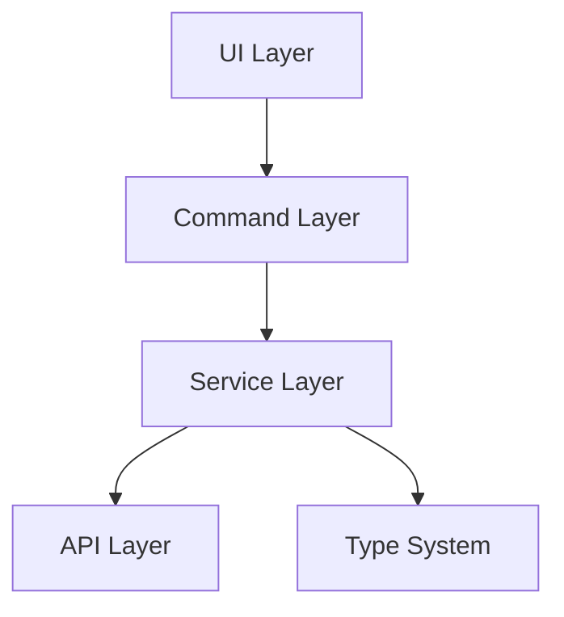

# otak-committer 設計ドキュメント

## ドキュメント構成

### 1. 機能設計
- [PR機能設計](./features/pr-feature-design.md)
- [メッセージスタイル拡張設計](./features/message-style-update-design.md)

### 2. 技術設計
- [論理設計](./technical/logical-design.md)
- [コード規約](./technical/code-rules.md)

## 機能概要

otak-committerは、VS Code拡張機能として以下の機能を提供します：

1. インテリジェントなコミットメッセージ生成
   - 25言語サポート
   - 3段階のメッセージスタイル
   - 絵文字サポート

2. PRメッセージ生成
   - Issue連携
   - Base/Compare指定による差分分析
   - コミットメッセージと同様の多言語サポート

## アーキテクチャ概要

詳細は[論理設計](./technical/logical-design.md)を参照してください。

## 開発ガイドライン

1. コード規約に従った実装
2. 必要なテストの作成
3. ドキュメントの更新

## リリースプロセス

1. バージョン番号の更新
2. CHANGELOGの更新
3. VSIXパッケージの作成
4. GitHub Releaseの作成