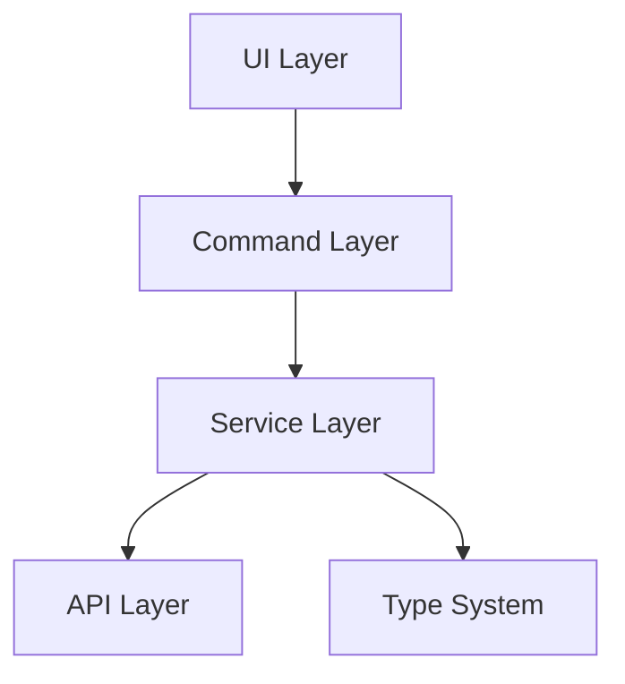
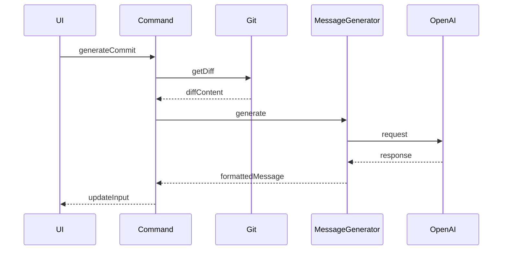
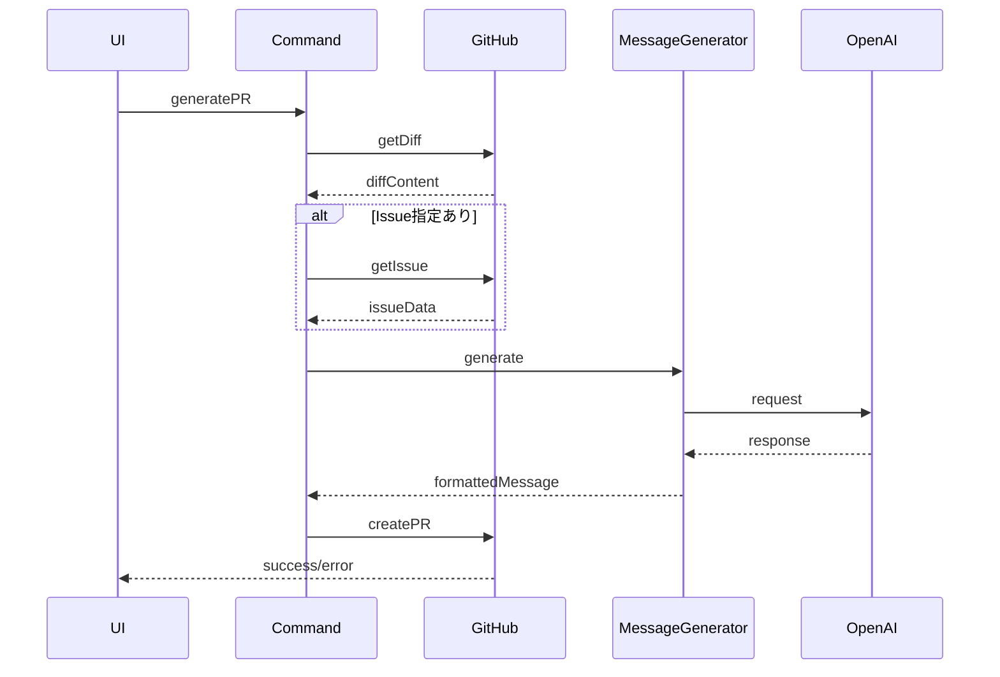

# 論理設計ドキュメント

## 1. システムアーキテクチャ



### 1.1 レイヤー構造
1. UI Layer（src/extension.ts）
   - ステータスバー管理
   - コマンド登録
   - 設定管理

2. Command Layer（src/commands/）
   - generateCommit.ts
   - generatePR.ts
   - 各コマンドのロジック分離

3. Service Layer（src/services/）
   - git.ts: Gitインターフェース
   - github.ts: GitHub API通信
   - openai.ts: OpenAI API通信

4. API Layer
   - VS Code API
   - GitHub API
   - OpenAI API

## 2. データフロー

### 2.1 コミットメッセージ生成フロー


### 2.2 PR生成フロー


## 3. 依存関係管理

### 3.1 コア依存関係
```typescript
// Core dependencies
interface Dependencies {
    git: GitService;
    github: GitHubService;
    openai: OpenAIService;
    config: ConfigService;
}

// Dependency injection
class CommandHandler {
    constructor(private deps: Dependencies) {}
}
```

### 3.2 設定管理
```typescript
class ConfigService {
    // 言語設定
    getLanguageConfig(): LanguageConfig;
    // メッセージスタイル
    getMessageStyle(type: 'commit' | 'pr'): MessageStyleConfig;
    // 絵文字設定
    getEmojiConfig(): EmojiConfig;
}
```

## 4. エラー処理戦略

### 4.1 エラー階層
```typescript
// Base error
class ExtensionError extends Error {
    constructor(
        message: string,
        public readonly code: ErrorCode,
        public readonly details?: unknown
    ) {
        super(message);
    }
}

// Specific errors
class APIError extends ExtensionError {}
class ValidationError extends ExtensionError {}
class ConfigurationError extends ExtensionError {}
```

### 4.2 エラーハンドリングフロー
```typescript
async function handleCommand(cmd: Command): Promise<Result> {
    try {
        // 1. 入力検証
        validateInput(cmd);

        // 2. 設定確認
        validateConfig();

        // 3. API実行
        const result = await executeCommand(cmd);

        // 4. 結果整形
        return formatResult(result);
    } catch (error) {
        // エラー種別に応じた処理
        handleError(error);
    }
}
```

## 5. メッセージ生成システム

### 5.1 抽象化レイヤー
```typescript
interface MessageGenerator {
    generate(params: MessageParams): Promise<string>;
}

class CommitMessageGenerator implements MessageGenerator {
    generate(params: MessageParams): Promise<string>;
}

class PRMessageGenerator implements MessageGenerator {
    generate(params: MessageParams): Promise<string>;
}
```

### 5.2 メッセージ合成プロセス
```typescript
class MessageComposer {
    compose(
        type: 'commit' | 'pr',
        content: string,
        options: {
            emoji?: boolean;
            style?: MessageStyle;
            language?: string;
        }
    ): string {
        // 1. ベースメッセージ生成
        let message = this.generateBase(content);

        // 2. スタイル適用
        message = this.applyStyle(message, options.style);

        // 3. 絵文字追加（設定時）
        if (options.emoji) {
            message = this.addEmoji(message);
        }

        // 4. 言語固有のフォーマット適用
        return this.applyLanguageFormat(message, options.language);
    }
}
```

## 6. 拡張性への対応

### 6.1 プラグインシステム
```typescript
interface Plugin {
    id: string;
    hooks: {
        beforeMessageGenerate?: Hook;
        afterMessageGenerate?: Hook;
        beforePRCreate?: Hook;
        afterPRCreate?: Hook;
    };
}

// プラグイン登録システム
class PluginManager {
    register(plugin: Plugin): void;
    execute(hookName: string, context: any): Promise<void>;
}
```

### 6.2 カスタマイズポイント
1. メッセージテンプレート
2. 絵文字マッピング
3. プロンプト生成
4. API通信処理

## 7. テスト戦略

### 7.1 テストレベル
1. 単体テスト
   - サービス層の各メソッド
   - メッセージ生成ロジック
   - エラーハンドリング

2. 統合テスト
   - コマンド実行フロー
   - API連携
   - 設定変更の影響

3. E2Eテスト
   - 実際のGitリポジトリでの操作
   - GitHub APIとの連携
   - VS Code拡張機能としての動作

### 7.2 テスト環境
```typescript
interface TestContext {
    git: MockGitService;
    github: MockGitHubService;
    openai: MockOpenAIService;
    config: MockConfigService;
}

// テストファクトリー
class TestFactory {
    createContext(overrides?: Partial<TestContext>): TestContext;
    createCommand(type: 'commit' | 'pr'): Command;
    createDiff(): string;
}